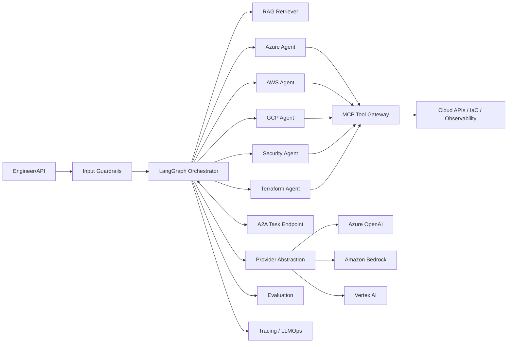

# Phase 2 architecture

```mermaid
flowchart LR
 U[Engineer/API] --> G[Input Guardrails]
 G --> LG[LangGraph Orchestrator]
 LG --> R[RAG Retriever]
 LG --> AZ[Azure Agent]
 LG --> AW[AWS Agent]
 LG --> GC[GCP Agent]
 LG --> SE[Security Agent]
 LG --> TF[Terraform Agent]
 AZ & AW & GC & SE & TF --> MCP[MCP Tool Gateway]
 MCP --> C[Cloud APIs / IaC / Observability]
 LG <--> A2A[A2A Task Endpoint]
 LG --> LLM[Provider Abstraction]
 LLM --> AO[Azure OpenAI]
 LLM --> BR[Amazon Bedrock]
 LLM --> VX[Vertex AI]
 LG --> EV[Evaluation]
 LG --> OT[Tracing / LLMOps]
```
