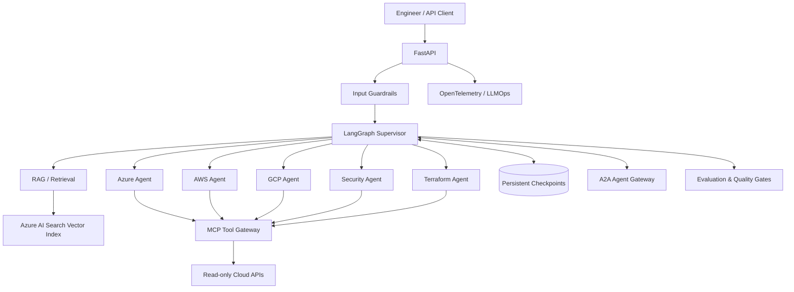

# Phase 3 Production Architecture

```mermaid
flowchart TB
U[Engineer / API Client] --> API[FastAPI]
API --> G[Input Guardrails]
G --> S[LangGraph Supervisor]
S --> R[RAG / Retrieval]
R --> AIS[Azure AI Search Vector Index]
S --> AZ[Azure Agent]
S --> AW[AWS Agent]
S --> GC[GCP Agent]
S --> SEC[Security Agent]
S --> TF[Terraform Agent]
AZ & AW & GC & SEC & TF --> MCP[MCP Tool Gateway]
MCP --> CA[Read-only Cloud APIs]
S <--> CP[(Persistent Checkpoints)]
S <--> A2A[A2A Agent Gateway]
API --> OT[OpenTelemetry / LLMOps]
S --> EV[Evaluation & Quality Gates]
```

Production principle: retrieval and inventory are read-only by default. Mutating tools require explicit policy authorization and human approval.
